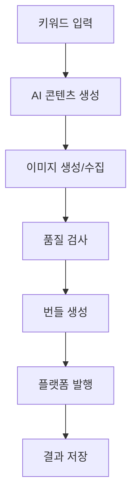

# AI Writer 아키텍처 가이드

## 개요

AI Writer는 SOLID 원칙을 기반으로 설계된 모듈형 자동 블로그 포스팅 시스템입니다. 키워드 입력만으로 AI가 콘텐츠를 생성하고, 품질 검사를 거쳐 WordPress와 Google Blogger에 자동으로 발행할 수 있습니다.

## 아키텍처 원칙

### SOLID 원칙 적용

1. **Single Responsibility Principle (SRP)**
   - 각 모듈은 단일 책임을 가짐
   - Core, Gen, Publisher, Media, Quality 모듈 분리

2. **Open-Closed Principle (OCP)**
   - BasePublisher 인터페이스로 새로운 플랫폼 추가 가능
   - 기존 코드 수정 없이 확장 가능

3. **Liskov Substitution Principle (LSP)**
   - 모든 Publisher는 BasePublisher 인터페이스 준수
   - 동일한 방식으로 사용 가능

4. **Interface Segregation Principle (ISP)**
   - 클라이언트별 필요한 인터페이스만 제공
   - API 라우터별 역할 분리

5. **Dependency Inversion Principle (DIP)**
   - 고수준 모듈이 저수준 모듈에 의존하지 않음
   - 추상화된 인터페이스에 의존

## 프로젝트 구조

```
CreateAutoContentByAi/
├── apps/                    # 애플리케이션 계층
│   ├── api/                 # FastAPI 백엔드 서버
│   │   ├── main.py          # 메인 애플리케이션
│   │   └── routers/         # API 라우터
│   │       ├── health.py    # 헬스체크
│   │       ├── bundles.py   # 번들 관리
│   │       ├── generation.py # 콘텐츠 생성
│   │       └── publishing.py # 발행 관리
│   └── cli/                 # CLI 도구
├── packages/                # 핵심 비즈니스 로직
│   ├── core/                # 핵심 인프라
│   │   ├── config.py        # 설정 관리
│   │   ├── logging.py       # 로깅 시스템
│   │   ├── exceptions.py    # 예외 처리
│   │   ├── retry.py         # 재시도 로직
│   │   ├── database.py      # 데이터베이스
│   │   └── utils.py         # 유틸리티
│   ├── gen/                 # AI 콘텐츠 생성
│   ├── media/               # 이미지 처리
│   ├── quality/             # 품질 검사
│   ├── packager/            # 번들 생성
│   └── publisher/           # 발행 시스템
│       ├── base.py          # 기본 인터페이스
│       ├── models.py        # 데이터 모델
│       ├── wp/              # WordPress 어댑터
│       │   ├── client.py    # REST API 클라이언트
│       │   └── publisher.py # 발행 구현체
│       └── blogger/         # Blogger 어댑터
│           ├── client.py    # Google API 클라이언트
│           └── publisher.py # 발행 구현체
├── web/                     # React 프론트엔드
│   ├── src/
│   │   ├── components/      # 컴포넌트
│   │   ├── pages/           # 페이지
│   │   ├── services/        # API 서비스
│   │   └── stores/          # 상태 관리
├── prompts/                 # AI 프롬프트
├── runs/                    # 실행 로그
├── bundles/                 # 생성된 번들
└── data/                    # 데이터 저장
```

## 모듈별 상세 설명

### 1. Core 모듈 (`packages/core/`)

시스템의 핵심 인프라를 제공합니다.

#### 주요 구성요소

- **config.py**: Pydantic 기반 설정 관리
  - 환경변수 자동 바인딩
  - 타입 안전성 보장
  - 검증 로직 내장

- **logging.py**: 구조화된 로깅 시스템
  - 컬러링된 콘솔 출력
  - 파일 로테이션
  - 로그 레벨별 필터링

- **exceptions.py**: 계층적 예외 처리
  - 재시도 가능/불가능 예외 구분
  - 에러 코드 표준화
  - 상세한 에러 정보 제공

- **retry.py**: 지수 백오프 재시도 로직
  - 네트워크 오류 자동 복구
  - Jitter 적용으로 서버 부하 분산
  - 동기/비동기 모두 지원

### 2. Publisher 모듈 (`packages/publisher/`)

Strategy 패턴을 사용한 플랫폼별 발행 시스템입니다.

#### 아키텍처 패턴

```python
# 기본 인터페이스
class BasePublisher(ABC):
    @abstractmethod
    async def publish_draft(self, ...): pass
    
    @abstractmethod
    async def publish_immediately(self, ...): pass
    
    @abstractmethod
    async def schedule_publish(self, ...): pass

# 구현체
class WordPressPublisher(BasePublisher): ...
class BloggerPublisher(BasePublisher): ...
```

#### WordPress 어댑터
- REST API 기반 통신
- Application Passwords 인증
- 미디어 업로드 자동화
- 카테고리/태그 자동 생성

#### Blogger 어댑터
- Google API v3 사용
- OAuth2 인증
- 예약 발행 지원
- 라벨 관리

### 3. API 계층 (`apps/api/`)

FastAPI 기반 REST API 서버입니다.

#### 주요 엔드포인트

- `GET /api/v1/health/`: 시스템 상태 확인
- `POST /api/v1/generation/generate`: 콘텐츠 생성
- `GET /api/v1/bundles/`: 번들 목록 조회
- `POST /api/v1/publishing/publish`: 발행 작업

#### 특징
- 비동기 처리로 높은 성능
- Background Tasks로 장시간 작업 처리
- Pydantic 모델로 요청/응답 검증
- CORS 설정으로 프론트엔드 연동

### 4. 프론트엔드 (`web/`)

React + TypeScript + Ant Design 기반 대시보드입니다.

#### 주요 페이지
- **대시보드**: 시스템 상태와 최근 활동
- **콘텐츠 생성**: AI 콘텐츠 생성 인터페이스  
- **번들 관리**: 생성된 콘텐츠 관리
- **발행 관리**: 플랫폼별 발행 상태
- **설정**: 시스템 설정 관리

## 데이터 플로우

### 콘텐츠 생성 플로우



### 데이터 변환 과정

1. **입력**: 사용자 키워드 + 메타데이터
2. **생성**: AI가 제목, 본문, SEO 메타 생성
3. **이미지**: 관련 이미지 검색/생성
4. **검증**: 맞춤법, 링크, SEO 점검
5. **번들**: 표준화된 포스트 번들 생성
6. **발행**: 플랫폼별 API 호출
7. **추적**: 결과 로깅 및 상태 업데이트

## 설정 시스템

### 환경변수 구조

```bash
# 애플리케이션
APP_ENV=dev|prod
TZ=Asia/Seoul
LOG_LEVEL=DEBUG|INFO|WARNING|ERROR

# WordPress
WP_BASE_URL=https://your-site.com
WP_APP_USER=username
WP_APP_PASSWORD=app-password

# Google Blogger
GOOGLE_CLIENT_ID=client-id
GOOGLE_CLIENT_SECRET=client-secret
GOOGLE_REFRESH_TOKEN=refresh-token
BLOGGER_BLOG_ID=blog-id

# AI 서비스
AI_PROVIDER=openai|anthropic
OPENAI_API_KEY=sk-...
ANTHROPIC_API_KEY=sk-ant-...
```

### 설정 검증

- 필수 필드 자동 검증
- 플랫폼별 설정 완성도 확인
- 타입 안전성 보장
- 런타임 검증

## 에러 처리 전략

### 예외 계층구조

```python
AIWriterError (기본)
├── RetryableError (재시도 가능)
│   ├── APIError
│   ├── ContentGenerationError
│   └── PublishingError
└── FatalError (재시도 불가)
    ├── ConfigurationError
    └── AuthenticationError
```

### 재시도 전략

- **지수 백오프**: 1s → 2s → 4s → 8s → 16s
- **Jitter 적용**: ±25% 랜덤 지연
- **최대 재시도**: 5회
- **선택적 재시도**: RetryableError만 재시도

## 보안 고려사항

### 인증 및 권한
- WordPress: Application Passwords 사용
- Blogger: OAuth2 Refresh Token 사용
- 환경변수로 민감정보 관리

### 데이터 보호
- 로그에서 민감정보 마스킹
- HTTPS 강제 사용
- CORS 정책 적용
- SQL Injection 방지

### API 보안
- 레이트 리미팅
- 입력 검증
- 에러 메시지 최소화
- 보안 헤더 적용

## 모니터링 및 로깅

### 로깅 레벨
- **DEBUG**: 개발 디버깅 정보
- **INFO**: 일반 운영 정보
- **WARNING**: 주의가 필요한 상황
- **ERROR**: 에러 발생
- **CRITICAL**: 시스템 중단 수준

### 메트릭 수집
- 요청/응답 시간
- 성공/실패율
- 리소스 사용량
- 에러 발생률

### 추적 가능성
- 모든 실행을 JSONL 로그로 저장
- 요청 ID로 전체 플로우 추적
- 재현 가능한 실행 로그

## 성능 최적화

### 비동기 처리
- FastAPI의 비동기 엔드포인트
- Background Tasks 활용
- HTTP 클라이언트 연결 풀링

### 캐싱 전략
- 설정 정보 LRU 캐시
- API 응답 메모리 캐시
- 정적 파일 CDN 캐시

### 데이터베이스 최적화
- 인덱스 최적화
- 연결 풀 관리
- 쿼리 최적화

이 아키텍처는 확장성, 유지보수성, 테스트 용이성을 고려하여 설계되었으며, 새로운 플랫폼이나 기능 추가 시에도 기존 코드의 수정을 최소화할 수 있습니다.