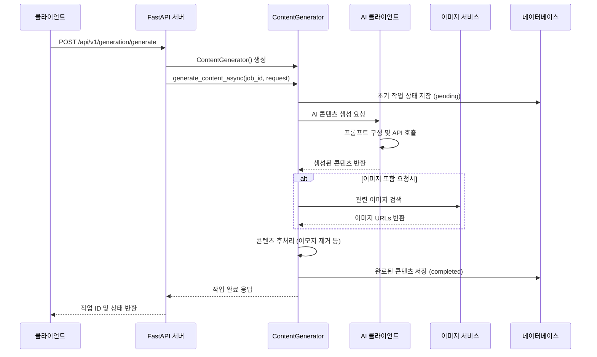

# 콘텐츠 생성 플로우 가이드

이 문서는 AI 콘텐츠 생성 시스템에서 `/generate` API가 호출되었을 때의 전체 작동 원리를 상세히 설명합니다.

## 목차
- [전체 플로우 개요](#전체-플로우-개요)
- [단계별 상세 설명](#단계별-상세-설명)
- [주요 컴포넌트](#주요-컴포넌트)
- [데이터 플로우](#데이터-플로우)
- [에러 처리](#에러-처리)
- [설정 및 환경](#설정-및-환경)

## 전체 플로우 개요



## 단계별 상세 설명

### 1. API 요청 수신 (`apps/api/routers/generation.py`)

클라이언트가 `/api/v1/generation/generate` 엔드포인트로 POST 요청을 보냅니다.

```python
@router.post("/generate", response_model=GenerationJobResponse)
async def generate_content(
    request: GenerateContentRequest,
    background_tasks: BackgroundTasks
) -> GenerationJobResponse:
```

**요청 파라미터:**
- `topic`: 생성할 콘텐츠의 주제
- `provider`: AI 제공자 (gemini, openai, claude 등)
- `tone`: 톤 (professional, casual, friendly 등)
- `word_count`: 목표 단어 수
- `include_images`: 이미지 포함 여부
- `target_language`: 대상 언어 (기본: 한국어)

### 2. ContentGenerator 초기화

```python
generator = ContentGenerator()
generation_request = GenerationRequest(
    topic=request.topic,
    provider=request.provider,
    tone=request.tone,
    word_count=request.word_count,
    include_images=request.include_images,
    target_language=request.target_language
)
```

### 3. 작업 ID 생성 및 초기 상태 저장

```python
job_id = generator.create_job_id()  # UUID4 생성
```

데이터베이스에 초기 작업 정보가 저장됩니다:
- 상태: `pending`
- 진행률: 0%
- 생성 시간 기록

### 4. AI 콘텐츠 생성 프로세스 (`packages/gen/content_generator.py`)

#### 4.1 AI 클라이언트 설정 가져오기

```python
ai_config = self._get_ai_config(request.provider)
provider, config = ai_config
```

환경 변수에서 API 키와 설정을 로드합니다:
- `GEMINI_API_KEY`
- `OPENAI_API_KEY`
- `CLAUDE_API_KEY`
- `GROK_API_KEY`

#### 4.2 프롬프트 구성

AI 모델에 전달할 프롬프트를 구성합니다. 프롬프트 생성은 `_generate_with_ai()` 메소드에서 시작되어 두 개의 전용 메소드를 호출합니다:

```python
async def _generate_with_ai(self, provider: AIProvider, config: AIClientConfig, request: GenerationRequest):
    # 프롬프트 생성
    system_prompt = self._create_system_prompt(request)  # 시스템 프롬프트 생성
    user_prompt = self._create_user_prompt(request)      # 사용자 프롬프트 생성
    
    ai_request = AIRequest(
        messages=[
            AIMessage(role="system", content=system_prompt),
            AIMessage(role="user", content=user_prompt)
        ],
        max_tokens=config.max_tokens,
        temperature=config.temperature
    )
```

##### 4.2.1 시스템 프롬프트 생성 (`_create_system_prompt()`)

시스템 프롬프트는 AI의 역할과 기본 규칙을 정의합니다:

```python
def _create_system_prompt(self, request: GenerationRequest) -> str:
    """Create system prompt for AI."""
    # 언어 설정
    language_instruction = ""
    if request.target_language == "ko":
        language_instruction = "모든 응답은 한국어로 작성해주세요."
    elif request.target_language == "en":
        language_instruction = "Please respond in English."
    
    # 주제 유형 분석 (비교글, 랭킹글 등)
    is_comparison_topic = any(keyword in request.topic.lower() 
                            for keyword in ['vs', 'versus', '대', '비교', '차이'])
    
    # TOP/랭킹 주제 감지 및 숫자 추출
    ranking_number = self._detect_ranking_number(request.topic)
```

**시스템 프롬프트 주요 구성 요소:**
- **역할 정의**: 전문 콘텐츠 작성자로서의 역할
- **언어 설정**: 한국어/영어 응답 지시
- **콘텐츠 유형 감지**: 비교글, 랭킹글, 일반글 구분
- **스타일 가이드**: 브런치 스타일의 깔끔한 구조
- **JSON 출력 형식**: 구조화된 데이터 반환 지시

##### 4.2.2 사용자 프롬프트 생성 (`_create_user_prompt()`)

사용자 프롬프트는 구체적인 요구사항과 제약사항을 정의합니다:

```python
def _create_user_prompt(self, request: GenerationRequest) -> str:
    """Create user prompt for AI."""
    # 단어수 계산 (10% 마진 허용)
    margin = max(200, int(request.word_count * 0.1))
    min_words = request.word_count - margin
    max_words = request.word_count + margin
    
    # 이미지 포함 지시사항
    image_instructions = ""
    if request.include_images:
        image_instructions = "각 주요 섹션에 관련 이미지 3-5개 포함"
```

**사용자 프롬프트 주요 구성 요소:**
1. **🚨 절대적 단어수 준수**: 목표 단어수 ±10% 범위 내 작성
2. **상세한 구조 지시**: 8-12개 섹션으로 구성, 섹션당 150-200단어
3. **이미지 포함 지시**: 각 섹션별 관련 이미지 요구사항
4. **링크 포함 필수**: 각 섹션마다 관련 페이지 링크 포함
5. **HTML 스타일링**: 브런치 스타일의 시각적 디자인
6. **실제 주제**: `{request.topic}` - 생성할 콘텐츠의 실제 주제

##### 4.2.3 특수 프롬프트 처리

**비교 주제 처리:**
- 'vs', '대', '비교' 키워드 감지
- 비교 테이블 생성 지시
- 장단점 분석 요구

**랭킹 주제 처리:**
```python
# TOP 패턴 감지
top_patterns = [r'top\s*(\d+)', r'톱\s*(\d+)', r'베스트\s*(\d+)', 
               r'(\d+)가지', r'(\d+)개', r'(\d+)위']

# 한국어 숫자 처리
korean_numbers = {'세': 3, '삼': 3, '네': 4, '사': 4, '다섯': 5, ...}
```

**프롬프트 구조 최종 형태:**
1. **시스템 메시지**: 역할 정의 및 기본 규칙
2. **언어 설정**: 응답 언어 지정
3. **콘텐츠 유형별 지시**: 비교/랭킹/일반 콘텐츠 처리
4. **단어수 제약**: 정확한 단어수 범위 준수
5. **구조 요구사항**: HTML 스타일링 및 섹션 구성
6. **이미지 포함**: 관련 이미지 삽입 지시
7. **실제 주제**: 생성할 콘텐츠의 구체적 주제

#### 4.3 AI 클라이언트를 통한 콘텐츠 생성

```python
client = AIClientFactory.create_client(provider, config)
ai_request = AIRequest(
    messages=[system_message, user_message],
    model=config.model,
    max_tokens=config.max_tokens,
    temperature=config.temperature
)
response = await client.generate(ai_request)
```

### 5. AI 제공자별 처리 (`packages/ai_clients/`)

각 AI 제공자는 고유한 클라이언트를 통해 처리됩니다:

#### Gemini 클라이언트 (`gemini_client.py`)
- Google AI Studio API 사용
- JSON 응답 파싱 및 검증

#### OpenAI 클라이언트 (`openai_client.py`)
- OpenAI Chat Completions API 사용
- 한국어 인코딩 처리 포함

#### Claude 클라이언트 (`claude_client.py`)
- Anthropic Messages API 사용
- 긴 컨텍스트 처리 최적화

#### Grok 클라이언트 (`grok_client.py`)
- xAI API 사용
- 실시간 정보 활용

### 6. 콘텐츠 후처리 및 이미지 처리

#### 6.1 AI 응답 파싱
```python
content_data = json.loads(response.content)
content = GeneratedContent(
    title=content_data.get("title"),
    content=content_data.get("html_content"),
    summary=content_data.get("summary"),
    tags=content_data.get("tags", []),
    images=[]
)
```

#### 6.2 이미지 서비스 처리 (`packages/gen/image_service.py`)
```python
if request.include_images and content:
    images = await self.image_service.get_related_images(request.topic, 5)
    content.images = images
```

**이미지 처리 과정:**
1. 주제 관련 키워드 추출
2. 외부 이미지 API 호출 (Unsplash, Pixabay 등)
3. 이미지 메타데이터 수집 (URL, alt text, caption)
4. 콘텐츠에 이미지 정보 추가

#### 6.3 텍스트 정제
```python
content_json = {
    "title": remove_emojis(content.title),
    "html_content": remove_emojis(content.content),
    "summary": remove_emojis(content.summary),
    "tags": [remove_emojis(tag) for tag in content.tags],
    "images": processed_images
}
```

Windows 환경에서의 인코딩 문제 방지를 위해 이모지를 제거합니다.

### 7. 데이터베이스 저장 (`database.py`)

최종 콘텐츠가 JSON 형태로 데이터베이스에 저장됩니다:

```sql
UPDATE generation_jobs 
SET status = 'completed', 
    progress = 100, 
    content = ?, 
    updated_at = ? 
WHERE job_id = ?
```

### 8. 클라이언트 응답

API는 작업 완료 정보를 반환합니다:

```json
{
    "job_id": "uuid4-string",
    "status": "completed",
    "message": "Content generation completed"
}
```

## 주요 컴포넌트

### ContentGenerator (`packages/gen/content_generator.py`)
- 전체 콘텐츠 생성 프로세스 조율
- AI 클라이언트 관리
- 이미지 서비스 통합
- 데이터베이스 상태 관리

### AI 클라이언트 팩토리 (`packages/ai_clients/ai_factory.py`)
```python
class AIClientFactory:
    @staticmethod
    def create_client(provider: AIProvider, config: AIClientConfig):
        if provider == AIProvider.GEMINI:
            return GeminiClient(config)
        elif provider == AIProvider.OPENAI:
            return OpenAIClient(config)
        # ... 기타 제공자
```

### 이미지 서비스 (`packages/gen/image_service.py`)
- 외부 이미지 API 통합
- 이미지 메타데이터 관리
- 캐싱 및 최적화

### 데이터베이스 매니저 (`database.py`)
- SQLite 기반 작업 상태 관리
- 콘텐츠 영구 저장
- 트랜잭션 관리

## 데이터 플로우

### 입력 데이터 구조
```python
class GenerateContentRequest(BaseModel):
    topic: str
    provider: Optional[str] = "gemini"
    tone: Optional[str] = "professional"
    word_count: Optional[int] = 800
    include_images: bool = True
    target_language: str = "ko"
```

### 출력 데이터 구조
```json
{
    "title": "생성된 제목",
    "html_content": "<h1>스타일이 적용된 HTML 콘텐츠</h1>",
    "summary": "콘텐츠 요약",
    "tags": ["태그1", "태그2"],
    "images": [
        {
            "url": "https://example.com/image.jpg",
            "alt": "이미지 설명",
            "caption": "이미지 캡션"
        }
    ]
}
```

## 에러 처리

### 1. AI API 에러
```python
try:
    response = await client.generate(ai_request)
except Exception as e:
    # 작업 상태를 'failed'로 업데이트
    # 에러 메시지 저장
```

### 2. 인코딩 에러
```python
# OpenAI 클라이언트에서 한국어 텍스트 처리
try:
    content_bytes = content.encode('latin-1')
    content = content_bytes.decode('utf-8')
except (UnicodeDecodeError, UnicodeEncodeError):
    # 원본 텍스트 유지
```

### 3. 이미지 서비스 에러
```python
try:
    images = await self.image_service.get_related_images(topic, 5)
except Exception as e:
    print(f"Image loading failed: {e}")
    content.images = []  # 빈 이미지 리스트로 계속 진행
```

## 설정 및 환경

### 환경 변수
```bash
# AI API 키
GEMINI_API_KEY=your_gemini_key
OPENAI_API_KEY=your_openai_key
CLAUDE_API_KEY=your_claude_key
GROK_API_KEY=your_grok_key

# 이미지 서비스
UNSPLASH_ACCESS_KEY=your_unsplash_key
PIXABAY_API_KEY=your_pixabay_key

# 데이터베이스
DATABASE_URL=sqlite:///generation_jobs.db
```

### AI 모델 설정
```python
# packages/ai_clients/models.py
DEFAULT_CONFIGS = {
    AIProvider.GEMINI: {
        "model": "gemini-1.5-flash",
        "max_tokens": 4096,
        "temperature": 0.7
    },
    AIProvider.OPENAI: {
        "model": "gpt-4-turbo-preview",
        "max_tokens": 4096,
        "temperature": 0.7
    }
}
```

## 성능 최적화

### 1. 비동기 처리
모든 AI API 호출과 이미지 처리는 비동기로 수행됩니다.

### 2. 캐싱
- 이미지 메타데이터 캐싱
- AI 응답 캐싱 (동일 요청에 대해)

### 3. 에러 복구
- AI API 실패 시 대체 제공자 사용 가능
- 이미지 로딩 실패 시에도 텍스트 콘텐츠는 정상 제공

## 모니터링 및 로깅

### 디버그 로그
```python
print(f"DEBUG: Starting generation for {job_id}")
print(f"DEBUG: AI config obtained, generating content")
print(f"DEBUG: AI content generated: {type(content)}")
print(f"DEBUG: Successfully loaded {len(images)} images")
```

### 작업 상태 추적
데이터베이스를 통해 모든 작업의 진행 상태를 실시간으로 추적할 수 있습니다:
- `pending`: 대기 중
- `in_progress`: 진행 중  
- `completed`: 완료
- `failed`: 실패

## 확장 가능성

### 새로운 AI 제공자 추가
1. `packages/ai_clients/` 에 새 클라이언트 클래스 추가
2. `AIProvider` enum에 새 제공자 추가
3. `AIClientFactory`에 생성 로직 추가

### 새로운 콘텐츠 형식 지원
1. `GeneratedContent` 모델 확장
2. AI 프롬프트 템플릿 수정
3. 후처리 로직 추가

이 문서는 콘텐츠 생성 시스템의 전체적인 작동 원리를 설명하며, 각 단계별로 어떤 일이 일어나는지 상세히 기술하고 있습니다.